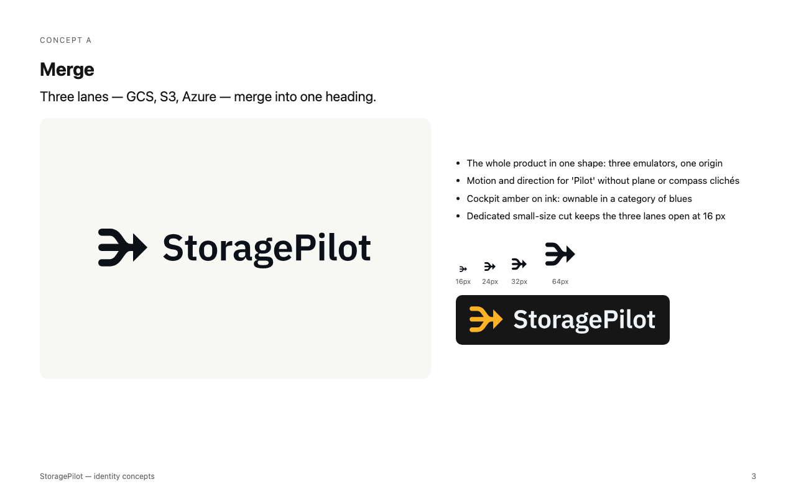

# StoragePilot — Logo Guidelines



## 1. The logo

**Merge.** Three lanes (GCS, S3 and Azure) merge into one heading: one origin, one direction.
The symbol is built from three round-capped lanes of equal width (the **lane unit**, 28 on the 256 grid)
that meet a 90° arrowhead. The wordmark is IBM Plex Sans SemiBold, the same family as the app UI, outlined and
tracked −1 %.

| Version | Use it for | File |
|---|---|---|
| Horizontal lockup | Default: headers, README, website | `logo/storagepilot-horizontal-{light,dark,black,white}.svg` |
| Stacked lockup | Square-ish spaces, splash screens, stickers | `logo/storagepilot-stacked-{light,dark,black,white}.svg` |
| Symbol | Avatars, app UI, when the name is already nearby | `logo/storagepilot-symbol*.svg` |
| Small symbol | Anything rendered at 24 px or smaller (favicons, the 18 px app header) | `logo/storagepilot-symbol-small*.svg` |
| Wordmark | Rare: only where the symbol is shown separately | `logo/storagepilot-wordmark.svg` |

`-light` = for light backgrounds (ink), `-dark` = for dark backgrounds (amber symbol, paper wordmark).
The `-reversed` / `-white` / `-dark` symbols are drawn with lanes 2 units thinner, because light shapes on dark
backgrounds look heavier. Use them on dark backgrounds instead of recolouring the light master.

## 2. Clear space

Keep at least **2 lane units** of empty space on every side. That's the width of two lanes at the size you
place it, and it's the same distance as the gap between the symbol and the wordmark in the horizontal lockup.

## 3. Minimum size

| Version | Digital | Print |
|---|---|---|
| Horizontal lockup | 96 px wide | 25 mm wide |
| Stacked lockup | 64 px wide | 18 mm wide |
| Symbol | 24 px | 6 mm |
| Small symbol | 16 px | 4 mm |

Below 24 px, always switch to the small symbol: its lanes are thicker and its gaps wider, so it doesn't clog.

## 4. Colour

| Name | HEX | RGB | CMYK (approx.) | Pantone (nearest, verify with a swatch) | Role |
|---|---|---|---|---|---|
| Pilot Amber | `#FFB224` | 255 178 36 | 0 30 86 0 | 1235 C | Symbol on dark backgrounds |
| Cockpit Ink | `#0D1117` | 13 17 23 | 43 26 0 91 | Black 6 C | Background, one-colour on light |
| Paper | `#F0F3F6` | 240 243 246 | 2 1 0 4 | — | Wordmark on dark |
| Amber Text | `#9A5B00` | 154 91 0 | 0 41 100 40 | — | Amber *text* on white (5.4:1, AA) |

Contrast: amber on ink 10.5:1, paper on ink 17:1, ink on white 18.9:1.
**Amber on white is only 1.8:1.** Never place the amber symbol on light backgrounds; use the ink version, or put
the amber symbol on an ink tile (as in the favicon and app icon).

Approved backgrounds: Cockpit Ink or darker, with the amber symbol + paper wordmark; white or light greys, with the
ink logo; photos only with the one-colour white logo on a calm, dark area.

## 5. Typography

- Wordmark: IBM Plex Sans SemiBold, outlined (don't retype it; use the SVGs).
- Brand type: IBM Plex Sans (UI and headings), IBM Plex Mono (code). Both are SIL Open Font License, so logo use
  is permitted. "IBM Plex" is a Reserved Font Name, which only matters if you modify and redistribute the font.

## 6. Don'ts

- Don't recolour the lanes individually (e.g. in GCS/S3/Azure colours). The point is that they're one.
- Don't use the amber symbol on white or light backgrounds.
- Don't rotate, mirror or animate the arrow to point anywhere but right.
- Don't stretch, outline, add shadows or gradients, or put it in a container other than the ink tile.
- Don't rearrange the lockup, change the symbol/wordmark ratio, or retype the name in another font.
- Don't use the regular symbol below 24 px; use the small cut.

## 7. Files and rebuilding

```
brand/
  logo/                 masters (SVG, outlined single paths, no strokes or live text)
  presentation/         logo.png (overview), in-use.png (mockups)
  tools/build_logo.py   regenerates every master from the geometry
```

Web icons live in `app/public/`: `favicon.svg`, `favicon.ico`, `apple-touch-icon.png`, `icon-192.png`,
`icon-512.png`, `maskable-512.png`, `site.webmanifest`, `og-image.svg` / `og-image.png`.

Rebuild the masters (needs `skia-python`, `fonttools`, `uharfbuzz` and IBM Plex Sans SemiBold, e.g. the
`@fontsource/ibm-plex-sans` 600 WOFF):

```bash
pip install skia-python fonttools uharfbuzz
python brand/tools/build_logo.py --font ibm-plex-sans-latin-600-normal.woff
```

The 18 px app header uses `app/public/logo-mark.svg` (the amber small cut).

## 8. Handover notes

- **Tests run:** SVG audit (all masters 97–100), rendering at 16/32/48/192/512 px, one-colour black and white, dark
  and light backgrounds, and mockups in a README, terminal, website header, browser tab, app icon and sticker (`presentation/in-use.png`).
- **Trademark:** no clearance search has been done. Run a professional search (USPTO/EUIPO, reverse image search)
  before wider launch. A "merge" arrow is a common UI glyph, so the lockup and the amber/ink colours carry most
  of the distinctiveness.
- **Open Graph:** `og-image.png` (1200×630) is what the meta tags point to, because social platforms don't render
  SVG. If you edit `og-image.svg`, re-export the PNG.
